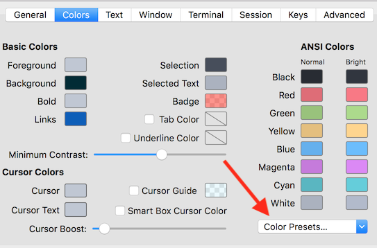

# andreacipriani dotfiles - fork from @holman

## components

There's a few special files in the hierarchy.

- **bin/**: Anything in `bin/` will get added to your `$PATH` and be made
  available everywhere.
- **Brewfile**: This is a list of applications for [Homebrew Cask](https://caskroom.github.io) to install: things like Chrome and 1Password and Adium and stuff. Might want to edit this file before running any initial setup.
- **topic/\*.zsh**: Any files ending in `.zsh` get loaded into your
  environment.
- **topic/path.zsh**: Any file named `path.zsh` is loaded first and is
  expected to setup `$PATH` or similar.
- **topic/completion.zsh**: Any file named `completion.zsh` is loaded
  last and is expected to setup autocomplete.
- **topic/install.sh**: Any file named `install.sh` is executed when you run `script/install`. To avoid being loaded automatically, its extension is `.sh`, not `.zsh`.
- **topic/\*.symlink**: Any file ending in `*.symlink` gets symlinked into
  your `$HOME`. This is so you can keep all of those versioned in your dotfiles
  but still keep those autoloaded files in your home directory. These get
  symlinked in when you run `script/bootstrap`.

## Prerequisites

- Install [oh-my-zsh](https://github.com/robbyrussell/oh-my-zsh)
- Install brew `/usr/bin/ruby -e "$(curl -fsSL https://raw.githubusercontent.com/Homebrew/install/master/install)"`
- Install iTerm
- Install Java https://java.com/en/download/mac_download.jsp

## Installation

- Run `brew install clang-format`
- `git clone git@github.com:andreacipriani/dotfiles.git ~/.dotfiles`
- `cd ~/.dotfiles`
- `script/bootstrap`
- `script/brew-install`
- `script/install`
- `/bin/dot`
- ruby git/clone-repos.rb

## Manual steps

- Load iterm colors the theme is in `iterm/one-dark996.itermcolors`
- Load iterm config: On `Profiles` press `Other Actions` and `Import JSON Profiles`, select `iterm/iterm_config.json`

## Things to backup

- Xcode UserData folder
- Alfred preferences
- iTerm preferences
- VSCode extensions - *TODO*: automate it (~/.vscode/extensions)
